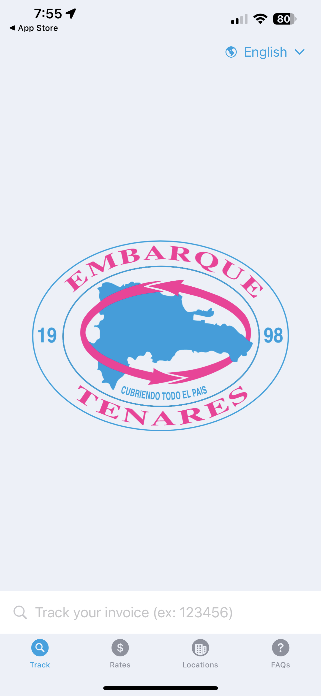
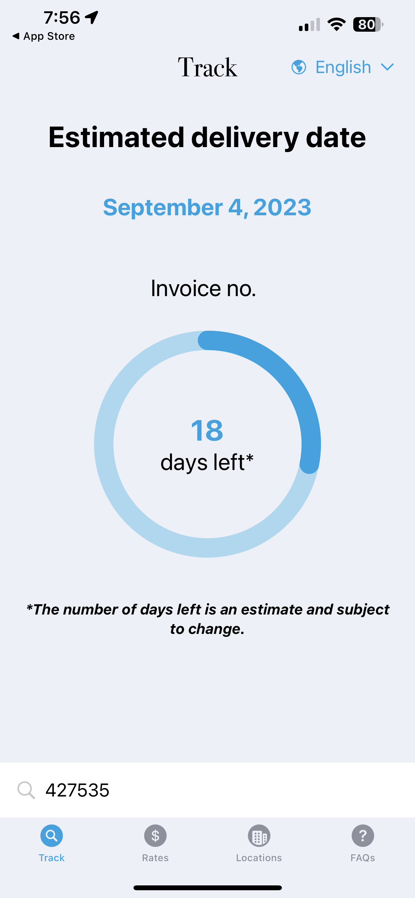
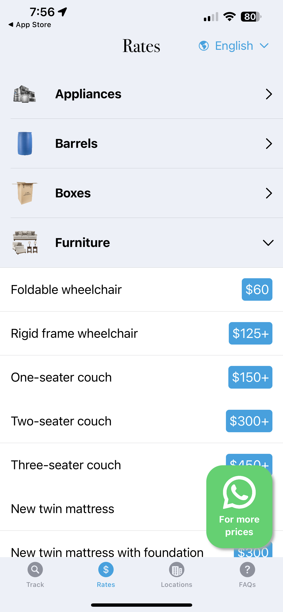
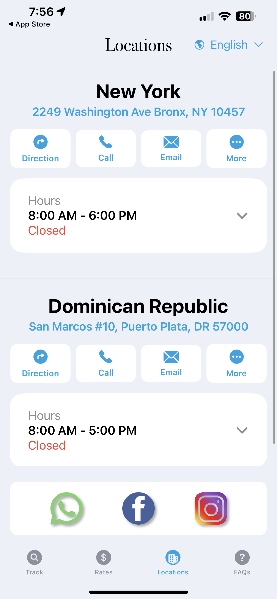
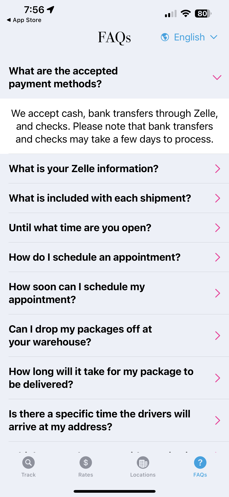

# EmbarqueTenaresSwiftUI
iOS &amp; Swift

# Embarque Tenares (Front-Facing iOS App: Swift)

An iOS application for clients to track packages and to find the latest prices, frequently asked questions, business policies, and location information.

## Table of Contents

1. [Installation](#installation)
2. [Configuration](#configuration)
3. [Prerequisites](#prerequisites)
4. [Usage](#usage)
5. [Features](#features)
6. [Production Link](#production-link)
7. [Contact Information](#contact-information)
8. [Acknowledgments](#acknowledgments)

## Installation

To set up and install the project, follow these steps:

- Install XCode (Versions 14+)
- Install [GitHub CLI](https://github.com/git-guides/install-git)
- Clone the repository: `git clone [repository_url]`
- Create and configure `Config` file with sensitive database information
- Build the project

## Configuration

Add a `Config` file containing the sensitive database information

## Prerequisites

Before running the project, ensure you have the following prerequisites:

- [ ] Xcode installed
- [ ] git installed
- [ ] Repository cloned
- [ ] `Config` file created & configured
- [ ] Project built

## Usage

### Development

1. Open the project using XCode
2. Choose any iPhone under the iOS Simulator Destination's
3. Press start the active scheme (Play button)
   
### Production

To deploy to the app store, follow these steps:

1. Sign up for a [Apple Developer Account](https://developer.apple.com/)
2. Sign in & create an app in the App Store Connect
3. Select 'iOS' for platform
4. Upload app name, description, keywords, screenshots, icons, and other relevant details.
5. Make sure the app meets Apple's guidelines and policies
6. Create an Archive of your app using Xcode and ensure it's properly signed and configured for distribution
7. Upload the app binary
8. Submit app for review
9. Determine release date
    
## Features

- Track package status using invoice number
- Internationalization to cater to bilingual clients
- View latest rates, FAQs, and location information like addresses, phones, hours and more
- Links to our social media platforms

### Screenshots

  
  
  
  
  

## Contact

For questions, feedback, or inquiries, feel free to contact me at elkingarcia.11@gmail.com or connect with me on [LinkedIn](https://www.linkedin.com/in/elkingarcia11/)
